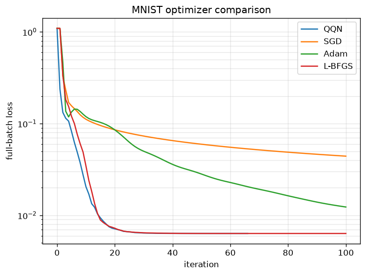

# qqn-jax

**Quasi-Quadratic-Newton (QQN)** optimizer for [JAX](https://github.com/google/jax).

QQN combines the robustness of steepest descent with the efficiency of
L-BFGS through a quadratic interpolation path:

```
d(t) = t(1-t)(-∇f) + t²(-H∇f)
```

- **t = 0** → pure steepest descent (`-∇f`)
- **t = 1** → pure L-BFGS direction (`-H∇f`)

A line search over this path automatically discovers the right blend of the
**gradient**, the L-BFGS **oracle**, and the **search** step at every
iteration.

## Installation

```bash
pip install qqn-jax
```

Or from source:

```bash
git clone https://github.com/example/qqn-jax
cd qqn-jax
pip install -e ".[dev]"
```

## Quick Start

```python
import jax.numpy as jnp
from qqn_jax import QQN

def rosenbrock(x):
    return jnp.sum(100.0 * (x[1:] - x[:-1]**2)**2 + (1.0 - x[:-1])**2)

solver = QQN(rosenbrock, maxiter=500, tol=1e-6)
params, state = solver.run(jnp.array([-1.2, 1.0]))
print(params)   # ~ [1.0, 1.0]
```

## JAX Acceleration

The solver is fully functional and JIT/vmap/pmap compatible:

```python
import jax

# JIT compilation
params, state = jax.jit(solver.run)(x0)

# Batched over many starting points
params, states = jax.vmap(solver.run)(x0_batch)
```

## Key Components

| Component | Role | Module |
|-----------|------|--------|
| Gradient  | steepest descent `-∇f` | `solver.py` |
| Oracle    | L-BFGS `-H∇f` (Optax-backed) | `lbfgs.py` |
| Search    | line search over `d(t)` (Optax-backed) | `line_search.py` |

The **line search is a first-class component** — it navigates the
one-dimensional space of direction blends defined by `d(t)` and enforces
sufficient decrease (Armijo) and curvature (strong Wolfe) conditions.

## Configuration

```python
QQN(
    fun,                       # objective f(params, *args) -> scalar
    maxiter=100,               # max iterations
    tol=1e-5,                  # gradient-norm tolerance
    history_size=10,           # L-BFGS memory m
    line_search="strong_wolfe",# or "backtracking"
    has_aux=False,             # fun returns (value, aux)
    t_grid=None,               # candidate interpolation params
)
```

## Algorithm

See [`algorithm.md`](algorithm.md) for a detailed description of the method,
its theoretical guarantees, and the central role of the line search.

## Results
Using [mnist_comparison.py](examples/mnist_comparison.py) a use can quickly validate the default configuration:

```text

optimizer     final_loss   iters   train_acc   test_acc   time(s)
-----------------------------------------------------------------
QQN         6.342553e-03      66      1.0000     0.9820     0.417
SGD         4.421039e-02     100      0.9913     0.9860     0.224
Adam        1.233064e-02     100      0.9993     0.9840     0.211
L-BFGS      6.342511e-03     100      1.0000     0.9820     1.273
```



This provides a computational demonstration of the hybrid behavior of this optimzation algorithm: it converges to the same final loss as L-BFGS, but does so in fewer iterations and less time by leveraging the gradient direction when the quasi-Newton oracle is less reliable.

## License

Apache 2.0