# QQN Architecture Diagrams

QQN is fundamentally a **software engineering solution** to continuous
optimization: it factors a monolithic "update rule" into four orthogonal,
independently swappable components (Gradient, Oracle, Search, Region) that
compose through a single immutable state object. This document uses Mermaid
diagrams to make that architecture legible.

Companion references:

- [`algorithm.md`](../../algorithm.md) — the comprehensive algorithm reference.
- [`oracles.md`](../../oracles.md) — the oracle abstraction.
- [`regions.md`](../../regions.md) — projective regions.
- [`spline_search.md`](../../spline_search.md) — the spline line search.
- [`equivalences.md`](../../equivalences.md) — classical-method equivalences.
- [`notation.md`](../../notation.md) — symbol reference.

---

## 1. The Four Axes as Orthogonal Components

The central software-engineering claim: QQN separates concerns into four
conceptually orthogonal axes, each a pluggable interface. This is the "ports and
adapters" pattern applied to optimization.

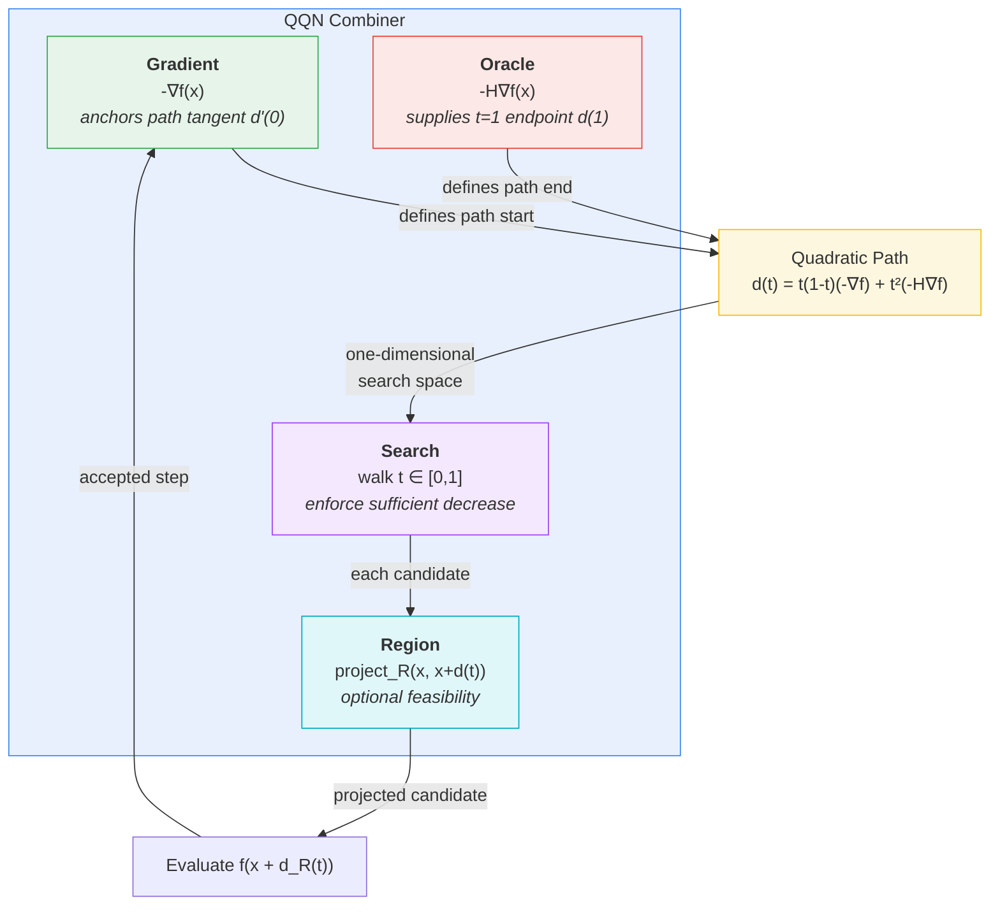

**Why this matters (SW engineering):** each axis is a `NamedTuple` interface
(`Oracle`, `Region`) with `init` / `direction`-or-`project` / `update`
callbacks. Swapping an implementation never touches the others — the very
definition of loose coupling.

---

## 2. The Quadratic Path as the Reframing

"Which direction?" becomes "where on the curve?". The path is the key data
structure that turns a discrete choice into a continuous, searchable object.

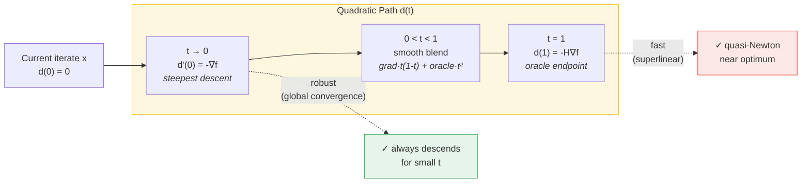

---

## 3. The Solver Loop (Control Flow)

A JAXopt-style `init_state` / `update` / `run` interface. The entire loop is a
`lax.while_loop` so it stays JIT/vmap/grad-compatible — no host-side control
flow.

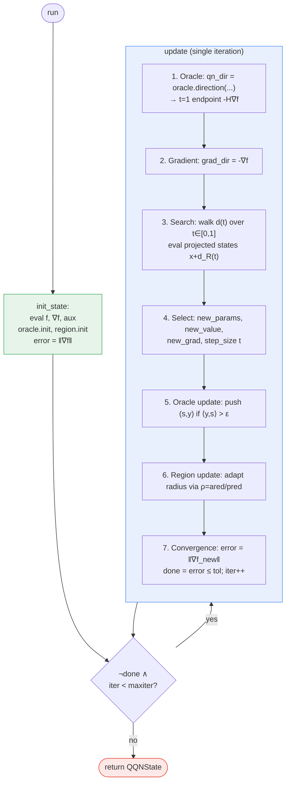

---

## 4. State Threading (Data Flow)

All state lives in a single immutable `QQNState` NamedTuple. This is the
"single source of truth" pattern — no hidden mutable buffers.

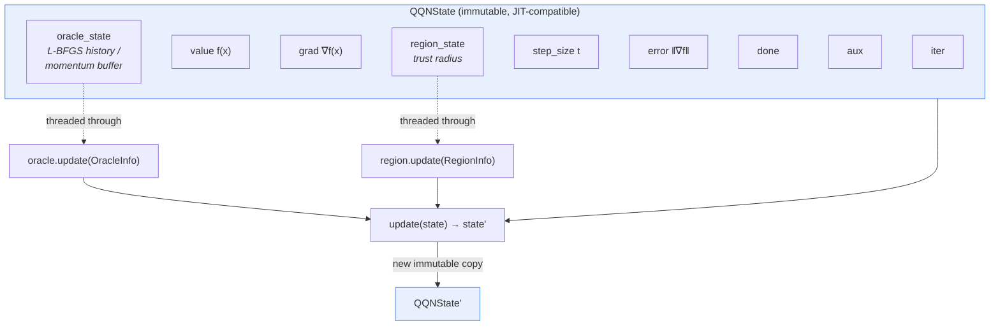

---

## 5. The Oracle Interface & Implementations (Strategy Pattern)

The oracle is a classic Strategy: one interface, many interchangeable
implementations. Combinators (`Fallback`, `Blend`) are the Composite pattern.

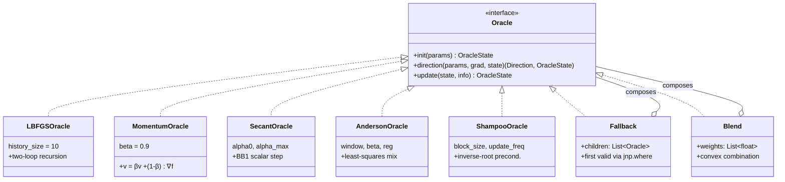

---

## 6. The Region Interface & Projected Path

Regions are pure projections applied *inside* the line search. The search
navigates the **projected path** `d_R(t)`, keeping descent guarantees on the
feasible set.

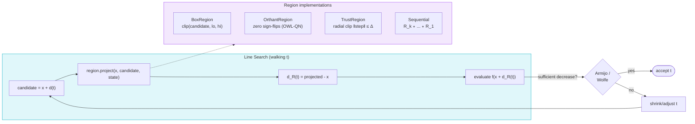

---

## 7. Line Search Strategies & the Spline Wrapper (Decorator Pattern)

The spline refinement is **not** a competing search but a Decorator that
*wraps* any inner search, reusing every probe as a control point.

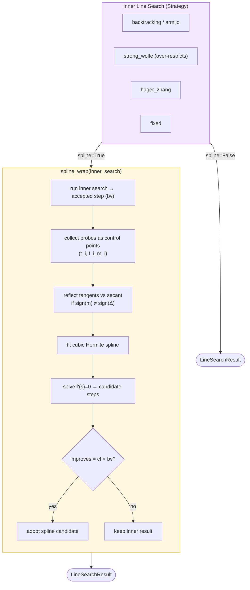

---

## 8. Spline Search Internals

Each probe carries both a fitness value and a slope. The cubic Hermite spline
honors both, and stationary points are found in closed form.

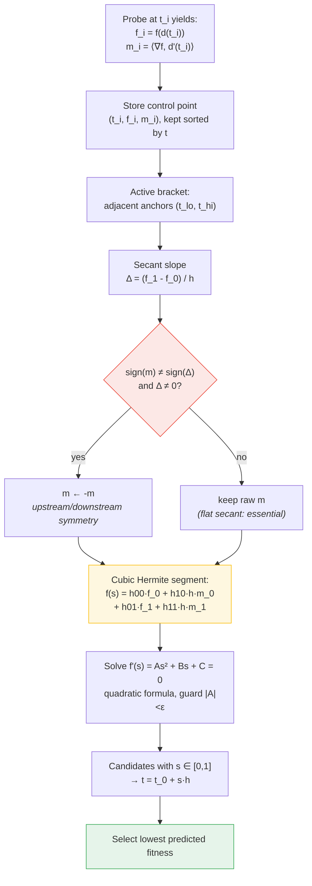

---

## 9. Equivalences: Configuration Space

Classical methods are just points in QQN's configuration space where one or two
axes are fixed. This is the "one framework, many products" payoff.

```mermaid
graph TB
    subgraph CONFIG["QQN Configuration Space"]
        direction TB
        AXES["(Oracle, Search, Region)"]
    end

    AXES --> GD["Gradient Descent<br/>any oracle, fixed/t→0, None"]
    AXES --> LBFGS["L-BFGS<br/>lbfgs, reach t=1, None"]
    AXES --> NEWTON["Newton<br/>exact-Hessian, accept t=1, None"]
    AXES --> MOM["Momentum / Heavy-Ball<br/>momentum, fixed t=1, None"]
    AXES --> BB["Barzilai-Borwein<br/>secant, accept t=1, None"]
    AXES --> AND["Anderson Acceleration<br/>anderson, accept t=1, None"]
    AXES --> TR["Trust Region<br/>lbfgs, ρ-acceptance, TrustRegion"]
    AXES --> OWL["OWL-QN<br/>lbfgs, line search, OrthantRegion"]
    AXES --> PG["Projected Gradient<br/>any, t→0, BoxRegion"]

    style CONFIG fill:#e8f0fe,stroke:#4285f4
    style GD fill:#e6f4ea,stroke:#34a853
    style LBFGS fill:#e6f4ea,stroke:#34a853
    style TR fill:#e0f7fa,stroke:#00acc1
    style OWL fill:#e0f7fa,stroke:#00acc1
    style PG fill:#e0f7fa,stroke:#00acc1
    style MOM fill:#fce8e6,stroke:#ea4335
    style BB fill:#fce8e6,stroke:#ea4335
    style AND fill:#fce8e6,stroke:#ea4335
```

---

## 10. The Robustness/Speed Trade-off QQN Resolves

The historical tension and how the path's endpoints dissolve it.

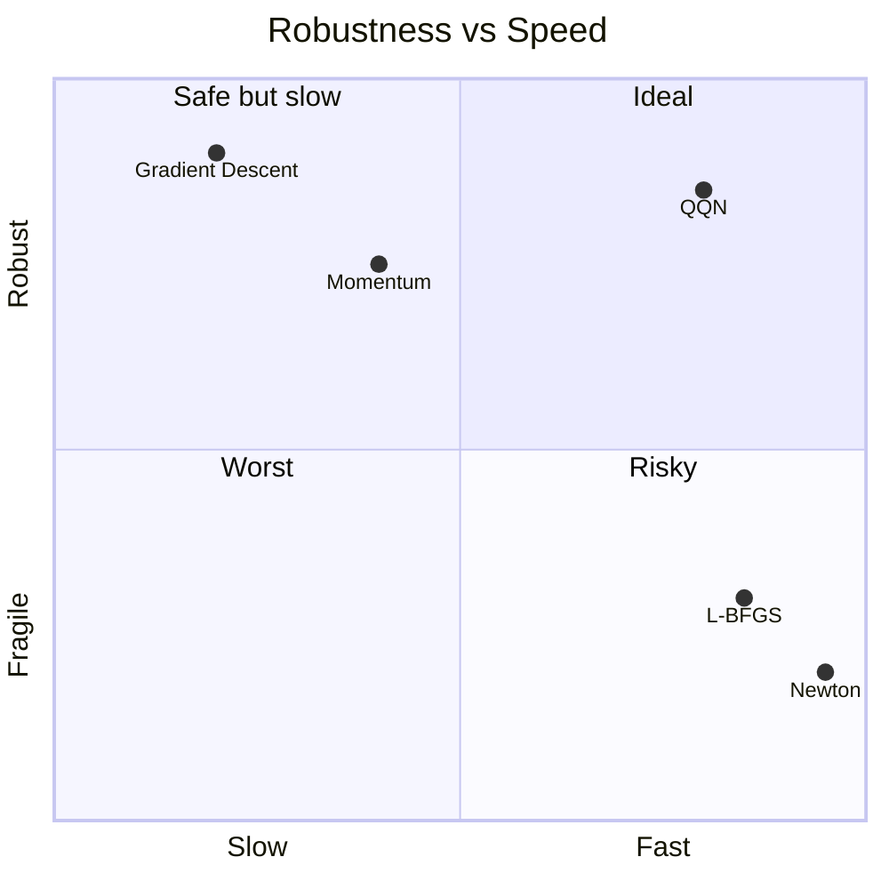

QQN lands in the "Ideal" quadrant because the path *begins* at the robust
gradient (`d'(0) = -∇f`) and *ends* at the fast oracle (`d(1) = -H∇f`); the line
search picks the best point in between, inheriting global convergence from the
tangent and superlinear speed from the endpoint.

---

## 11. Compilation & Transform Composition (Why JAX)

Pure functional design is what keeps the four axes genuinely modular while
remaining fully traceable.

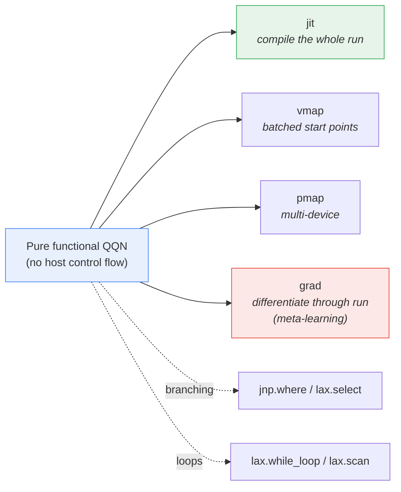

---

## 12. Sequence: One Accepted Step (End-to-End)

A sequence diagram tying all components together for a single iteration.

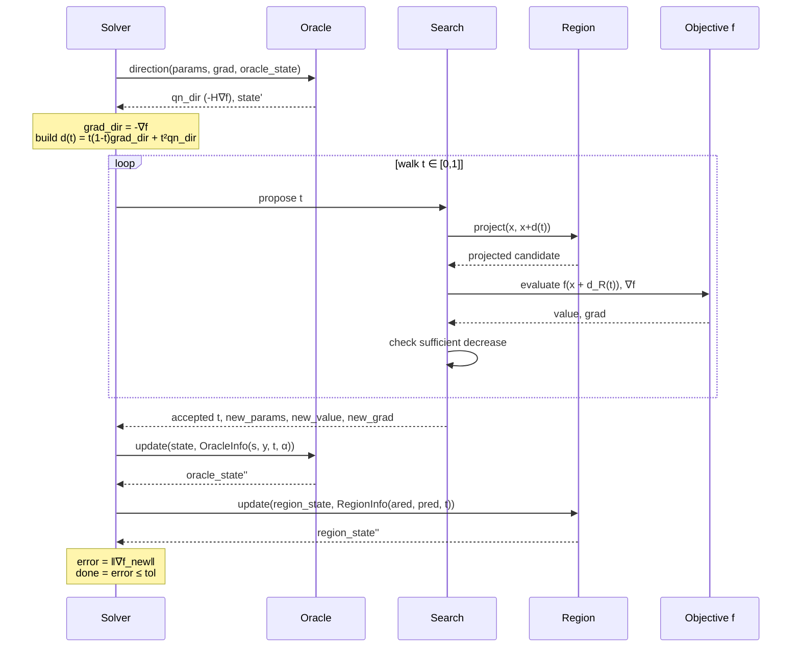

---

## Diagram Index

| # | Diagram                        | Teaches                                  |
|---|--------------------------------|------------------------------------------|
| 1 | Four axes                      | Separation of concerns / ports & adapters |
| 2 | Quadratic path                 | The core reframing (direction → curve)   |
| 3 | Solver loop                    | Control flow / `lax.while_loop`          |
| 4 | State threading                | Immutable single source of truth         |
| 5 | Oracle interface               | Strategy + Composite patterns            |
| 6 | Region / projected path        | Projection inside the search             |
| 7 | Spline wrapper                 | Decorator pattern                        |
| 8 | Spline internals               | Hermite interpolation + reflection       |
| 9 | Equivalences                   | Configuration space → classical methods  |
|10 | Trade-off quadrant             | Why QQN blends rather than chooses       |
|11 | Transform composition          | Why pure functional JAX                  |
|12 | Sequence of one step           | End-to-end component interaction         |