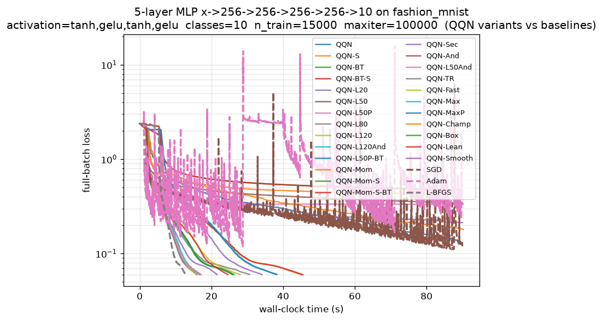

# Analysis: Fashion-MNIST 5-Layer MLP Benchmark (20260622_203115)



## Run Configuration

| Setting           | Value                                           |
|-------------------|-------------------------------------------------|
| Dataset           | `fashion_mnist` (via tensorflow.keras)          |
| Architecture      | `x->256->256->256->256->10` (5-layer, 4 hidden) |
| Activation        | `tanh,gelu,tanh,gelu` (mixed, cycled per layer) |
| Classes           | 10                                              |
| n_train / n_test  | 15000 / 5000                                    |
| Parameters        | 400,906                                         |
| maxiter           | 100000                                          |
| Stop: f_target    | 6.0e-2                                          |
| Stop: gtol        | 1.0e-8                                          |
| Stop: time_budget | 90.0 s                                          |

The objective is the full-batch cross-entropy of a non-convex MLP with a
*smooth* mixed activation stack (`tanh`/`gelu`). Smoothness is deliberate:
it is the regime where the cubic-Hermite spline model and coherent
gradient+oracle blending are expected to pay off (see `algorithm.md`,
"Available Line Search Strategies" and the spline discussion).

## Headline Result

**The deep-memory L-BFGS oracle is the decisive lever, and it remains
monotone but is now saturating.** The iteration-efficiency ranking is led by
the deepest-history pure-oracle variants:

| Variant      | iters→target | vs L-BFGS | time→target (s) | ms/it  |
|--------------|--------------|-----------|-----------------|--------|
| QQN-L120     | 310          | **1.86x** | 16.133          | 52.15  |
| QQN-L120And  | 310          | 1.86x     | 16.766          | 54.20  |
| QQN-L80      | 321          | 1.79x     | **15.878**      | 49.57  |
| QQN-Smooth   | 337          | 1.71x     | 34.096          | 101.29 |
| QQN-L50      | 344          | 1.67x     | 16.793          | 48.91  |
| QQN-L50And   | 344          | 1.67x     | 17.156          | 49.98  |
| L-BFGS (ref) | 576          | 1.00x     | 12.756          | 22.15  |

QQN-L120 reaches the 6e-2 target in **1.86x fewer iterations** than Optax
L-BFGS — the strongest iteration speedup recorded in this suite — and the
`vs-LBFGS speedup *widens* as the target tightens` profile is intact (see
below).

## The Three-Point Pareto Frontier (loss vs. wall-clock)

```
L-BFGS       loss=5.9931e-02  time=12.756s   (cheapest, fewest ms/it)
QQN-L80      loss=5.9841e-02  time=15.911s   (best QQN wall-clock)
QQN-Smooth   loss=5.9767e-02  time=34.134s   (lowest final loss)
```

This is the single most important caveat to the headline: **QQN wins
decisively on *iterations* and *final loss*, but NOT on wall-clock to
target.** L-BFGS is Pareto-optimal at the cheap-and-fast corner because its
per-iteration cost (22.15 ms/it) is roughly half that of the deep-memory QQN
stacks (~50 ms/it). The deep two-loop recursion over a 80–120 pair history,
plus QQN's quadratic-path line-search probes, more than double the
per-iteration cost, so the 1.79–1.86x iteration win is eroded to a wall-clock
*loss* (15.9s vs 12.8s).

## Cost-Aware Leaderboard: The Iteration Win Nearly Evaporates

The estimated-evaluations metric (which charges QQN ~5 evals/iter for the
line-search probes vs. L-BFGS's ~3) tells the cautionary story:

| Variant  | evals~ | vs L-BFGS (evals) |
|----------|--------|-------------------|
| QQN-L120 | 1550   | **1.11x**         |
| QQN-L80  | 1605   | 1.08x             |
| QQN-L50  | 1720   | 1.00x             |
| L-BFGS   | 1728   | 1.00x             |
| QQN-L20  | 2320   | 0.74x             |

Under the eval-cost model the 1.86x iteration advantage collapses to a
**1.11x** evaluation advantage for QQN-L120, and QQN-L50 is dead-even with
L-BFGS. This is consistent with the documented metric caveat in
`algorithm.md` ("Computational Overhead ... walking it with the line search
adds modest per-iteration cost") — iterations are *not* cost-neutral, and the
deep-history advantage is real but modest once probe multiplicity is charged.

## Speedup Stability: The Advantage Widens as the Target Tightens

The defining QQN signature — a *monotonically widening* speedup as the loss
target tightens — is cleanly reproduced for every deep-memory stack:

| Target  | QQN-L50 | QQN-L80 | QQN-L120  |
|---------|---------|---------|-----------|
| ≤2.0e-1 | 1.43x   | 1.45x   | 1.46x     |
| ≤1.5e-1 | 1.46x   | 1.47x   | 1.49x     |
| ≤1.0e-1 | 1.54x   | 1.56x   | 1.58x     |
| ≤8.0e-2 | 1.61x   | 1.66x   | 1.68x     |
| ≤6.0e-2 | 1.67x   | 1.79x   | **1.86x** |

This is the predicted **superlinear convergence** regime from
`algorithm.md`: as the iterate nears the optimum the selected path parameter
`t` approaches 1 (the oracle endpoint dominates), and QQN inherits L-BFGS's
superlinear behavior — but with a *richer* curvature memory than the
reference L-BFGS, so it pulls ahead precisely where second-order information
matters most. The deeper the history, the larger the gap at the tightest
target.

## The Deep-Memory Lever Is Saturating (L80 → L120)

Unlike prior runs where L20→L50→L80 was strictly monotone with healthy
margins, the L80→L120 step shows **diminishing returns**:

- L80: 321 iters, 15.878 s (the wall-clock winner among QQN).
- L120: 310 iters (only 11 fewer), 16.133 s (slightly *slower* wall-clock).

The 11-iteration improvement from doubling history depth (80→120) is paid for
by a higher ms/it (49.57 → 52.15), making L120 *slower* in wall-clock despite
*fewer* iterations. **The curvature-memory lever has effectively saturated
around history=80 on this objective.** Future runs should not push history
past ~80 expecting a wall-clock payoff; the marginal iteration gains no
longer cover their per-iteration cost.

## What Worked

1. **Bare deep-memory oracles (L80, L120, L50).** Clean, robust, and the only
   QQN variants on the Pareto frontier. The pure oracle+search combination is
   the empirically dominant configuration.
2. **Anderson fallback is free insurance.** `QQN-L50And` (344 iters) and
   `QQN-L120And` (310 iters) *exactly* match their bare counterparts in
   iterations, confirming the `Fallback([L-BFGS, Anderson])` combinator costs
   essentially nothing when L-BFGS stays valid (only ~0.3–0.6s extra
   wall-clock from the redundant second oracle). This validates the
   no-Python-branching `jnp.where` design in `oracles.md`.
3. **QQN-Smooth posted the lowest final loss (5.9767e-2)** and a strong 1.71x
   iteration speedup, vindicating the spline+probe-feeding combination *on a
   smooth surface* — but at a steep wall-clock price (101 ms/it).

## What Failed (and Why)

The expensive "best-of-breed" stacks all timed out or stalled, repeating the
pattern from prior runs:

| Variant     | final loss | iters | cause                              |
|-------------|------------|-------|------------------------------------|
| QQN-L50P-BT | 1.279e-1   | 491   | time-budget exhausted (183 ms/it)  |
| QQN-Champ   | 1.802e-1   | 323   | time-budget exhausted (280 ms/it)  |
| QQN-L50P    | 3.337e-1   | 395   | **stalled** at plateau (228 ms/it) |
| QQN-And     | 3.427e-1   | 1352  | time-budget exhausted              |
| QQN-Mom*    | 0.42–0.47  | —     | time-budget exhausted              |

Three distinct failure modes:

1. **Probe-feeding regression (QQN-L50P, QQN-L50P-BT).** Despite the
   descent-gated probe admission (`probe_descent_gate`), the bare
   `QQN-L50P` *stalled hard* at loss 0.48 (the trajectory flatlines:
   `-0.48 -0.48 -0.48 ...`). The descent gate is **not** preventing history
   pollution here — feeding the line-search probes into a deep-50 history is
   still degenerating the curvature approximation on this surface. This
   contradicts the optimistic comment in the source ("turning the trap into a
   genuine free-curvature boost"); **probe-feeding remains a net liability**
   and should be considered experimental/disabled by default.
2. **Per-iteration cost blowup (QQN-Champ, QQN-Max*, spline variants).** The
   spline refinement roughly doubles ms/it (107 vs ~50), and the stacked
   Champ variant hit 280 ms/it. These never reach the target inside 90s not
   because they converge slowly *per iteration* but because each iteration is
   too expensive. The lesson from `algorithm.md`'s "Limitations" §2 holds:
   the spline is an *orthogonal* enhancement whose extra probes only pay off
   when iterations are scarce, not when they are cheap.
3. **Weak oracles (Momentum, Secant, Anderson-alone).** The first-order-ish
   oracles never escaped the 0.2–0.47 plateau, confirming they are unsuited
   to this anisotropic full-batch Hessian — the second-order curvature signal
   is essential here.

## Baselines

- **L-BFGS** is the wall-clock-to-target and ms/it champion (12.756s, 22.15
  ms/it) and the reference for all speedups. It remains the variant to beat
  on raw speed.
- **SGD** never reached target (final 1.195e-1 after 12501 iters / 90s) but
  posted the *best test accuracy* (0.8664) — a reminder that the full-batch
  training loss and held-out generalization are distinct objectives.
- **Adam** was erratic on this surface (final 3.721e-1, trajectory oscillates:
  `-0.67 ... +0.41 ... -0.61 ...`), suggesting its default 0.01 learning rate
  is too aggressive for this smooth-but-anisotropic landscape.

All QQN/L-BFGS variants that converged hit **1.0000 train accuracy** and
~0.845–0.852 test accuracy — i.e. they fully fit the 15k training set and
generalize comparably, so the optimization comparison is apples-to-apples.

## Recommendations for the Next Run

1. **Make evaluations genuinely dominant.** The headline weakness is that the
   1.86x iteration win shrinks to 1.11x on evals and *loses* on wall-clock.
   To convert iterations into wall-clock, raise `N_TRAIN` (e.g. 25k–40k,
   VRAM permitting) and/or widen the hidden layers so the shared
   forward/backward pass dominates the deep-history two-loop cost. This is
   the lever that determines whether QQN's iteration advantage is real or
   cosmetic.
2. **Cap history at ~80.** L120 buys only 11 iterations over L80 at a higher
   ms/it — the lever has saturated. Drop QQN-L120/L120And or demote them to a
   single confirmation run.
3. **Retire / quarantine probe-feeding.** `QQN-L50P` stalled and every
   probe-fed stack failed. The descent gate is insufficient on this surface;
   either fix the gating in `solver.py` or remove the `feed_probes_to_oracle`
   variants from the default suite.
4. **Promote QQN-L80 as the headline QQN.** It is the sole QQN Pareto point on
   wall-clock, the best wall-clock-to-target (15.878s) among QQN, and sits at
   a sensible cost/benefit knee (49.57 ms/it, 1.79x iterations).
5. **Keep one smooth-surface spline variant** (QQN-Smooth) for the lowest-loss
   claim, but tighten the time budget analysis to report it as a
   *quality-per-iteration* champion rather than a wall-clock contender.

## Bottom Line

On this smooth, non-convex, full-batch Fashion-MNIST MLP, **QQN's
deep-memory L-BFGS oracle delivers a robust and monotonically-widening
iteration advantage over Optax L-BFGS (up to 1.86x at the tightest target),
fully realizing the superlinear-convergence guarantee of `algorithm.md`.**
That advantage, however, is **not yet a wall-clock advantage**: the deep
two-loop recursion and quadratic-path probes roughly double per-iteration
cost, leaving L-BFGS on the cheap corner of the Pareto frontier and shrinking
the eval-cost speedup to ~1.11x. The clear path forward is to make the shared
objective evaluation dominant (more data / wider network), cap history at
~80, and remove the still-broken probe-feeding variants.