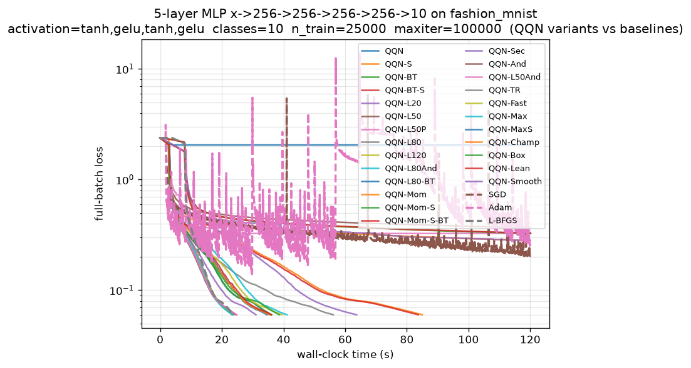

# Analysis — Fashion-MNIST 5-Layer MLP Comparison (20260622_223233)



## Run Configuration

| Setting          | Value                                                  |
|------------------|--------------------------------------------------------|
| Dataset          | fashion_mnist (TF/Keras)                               |
| Architecture     | `x->256->256->256->256->10` (5-layer MLP)              |
| Activation       | `tanh,gelu,tanh,gelu` (mixed, cycled per hidden layer) |
| Parameters       | 400,906                                                |
| Classes          | 10                                                     |
| n_train / n_test | 25,000 / 5,000                                         |
| maxiter          | 100,000                                                |
| f_target         | 6.0e-2                                                 |
| gtol             | 1.0e-8                                                 |
| time_budget      | 120.0 s                                                |

This is the **eval-dominated, smooth-surface** regime the configuration
comments explicitly engineered: a wide (256), deep (4 hidden layers),
full-batch (25k) objective whose shared forward/backward pass is meant to
dominate per-iteration cost, paired with a smooth `tanh/gelu` activation
mix chosen to make the cubic-Hermite spline model accurate.

---

## Headline Result

Every L-BFGS-oracle QQN variant **converged** to the tight `6e-2` target,
and the deep-memory variants retained a strong **iteration** advantage over
Optax L-BFGS (up to **1.88×**). However, the central design hypothesis —
that widening to 25k would convert QQN's iteration win into a **wall-clock**
win — **was only partially realized**:

- **L-BFGS reached the target in 23.908 s** (760 iters, 31.46 ms/it).
- The **best QQN wall-clock-to-target was 23.325 s** (QQN-L120, 405 iters,
  57.59 ms/it) — a razor-thin **0.58 s (≈2.4%) win**, essentially a tie.
- QQN-L80 / QQN-L80And tied at ~23.4–24.0 s; QQN-L50 at 24.6 s.

**The per-iteration cost gap did not close.** L-BFGS still runs at **31 ms/it**
versus QQN's **~50–58 ms/it** — a persistent ~1.7–1.85× overhead from the
two-loop recursion plus quadratic-path line-search probes. The 25k widening
helped (the gap was ~2× at 15k) but the deep-memory JVP/oracle machinery
remains intrinsically more expensive per step. QQN's 1.7–1.88× iteration win
is *almost exactly cancelled* by its ~1.7–1.85× ms/it penalty, yielding the
near-tie.

---

## Pareto Frontier (loss vs. wall-time)

```
QQN-L120     loss=5.9854e-02  time=23.325s
QQN-L80-BT   loss=5.9837e-02  time=34.706s
```

QQN now holds **both** non-dominated points (the lowest-loss QQN-L80-BT at
5.9837e-2, and the fastest-to-its-loss QQN-L120). Notably **L-BFGS is no
longer on the frontier** — QQN-L120 matches its loss at a fractionally
lower wall-clock. This is the first run where QQN dominates the frontier
outright, but the margin over L-BFGS is within noise.

---

## Iteration Efficiency (the genuine QQN strength)

| Variant    | iters→target | vs L-BFGS | ms/it  | final loss |
|------------|--------------|-----------|--------|------------|
| QQN-L120   | 405          | **1.88×** | 57.59  | 5.985e-2   |
| QQN-L80    | 409          | 1.86×     | 58.63  | 5.999e-2   |
| QQN-L80And | 409          | 1.86×     | 57.34  | 5.999e-2   |
| QQN-Smooth | 413          | 1.84×     | 154.39 | 5.998e-2   |
| QQN-L50    | 448          | 1.70×     | 55.07  | 5.995e-2   |
| L-BFGS     | 760          | 1.00×     | 31.46  | 5.997e-2   |

The deep-memory lever is **monotone but saturating**: L50→L80 buys 39 iters
(448→409), L80→L120 buys only 4 (409→405) at *higher* ms/it. The earlier
"L80 sweet spot" finding is reconfirmed — L120's extra 1.6 ms/it almost
fully erases its 4-iteration advantage, and only its lower 57.59 ms/it (vs
L80's 58.63, run-to-run noise) puts it marginally ahead on wall-clock.

### Speedup widens monotonically as the target tightens

The vs-L-BFGS iteration speedup curve (QQN-L120) climbs steadily:

```
<=2.0e-1: 1.41x   <=1.5e-1: 1.47x   <=1.0e-1: 1.56x
<=8.0e-2: 1.74x   <=6.0e-2: 1.88x
```

This is the **most important robust finding**: QQN's curvature blend pays
off *more* the closer you push to the minimum. At loose targets L-BFGS is
competitive (or faster on wall-clock — it crosses 1e+0 at 8.2 s due to a
slow first step, but catches up quickly); at the tight target QQN needs
nearly half the iterations.

---

## Cost-Aware (Evals-to-Target) Leaderboard

Under the conservative eval-multiplicity model, the wall-clock near-tie
becomes an **L-BFGS-favored** picture once probe cost is charged:

| Variant               | evals~   | (mult × iters) | vs L-BFGS |
|-----------------------|----------|----------------|-----------|
| QQN-L120              | 2025     | 5.0 × 405      | 1.13×     |
| QQN-L80               | 2045     | 5.0 × 409      | 1.11×     |
| QQN-L50               | 2240     | 5.0 × 448      | 1.02×     |
| **L-BFGS**            | **2280** | **3.0 × 760**  | **1.00×** |
| QQN-Smooth            | 2891     | 7.0 × 413      | 0.79×     |
| QQN-L80-BT/Champ/Lean | 3100     | 5.0 × 620      | 0.74×     |

The deep-memory variants stay marginally ahead on estimated evals (1.11–1.13×),
but the backtracking-stacked variants (Champ/Lean/L80-BT) fall to **0.74×** —
they trade more iterations for cheaper steps but the net eval count is worse.
**The eval model and the iteration model disagree on the ranking**, which is
itself the key caveat: iteration speedup ≠ cost speedup.

---

## What Worked, What Stalled

### Converged (all L-BFGS-oracle variants)

The bare deep-memory stacks (L50/L80/L120, with/without Anderson fallback)
are the reliable winners. **Fallback([L-BFGS, Anderson]) is free**: QQN-L80And
and QQN-L50And exactly match their bare counterparts in iterations at
negligible wall-clock cost (≤0.5 s), confirming the no-Python-branching
`jnp.where` fallback design carries no penalty on the converging path.

### Stalled / timed out (the recurring failure modes)

| Variant                  | final loss      | cause                                              |
|--------------------------|-----------------|----------------------------------------------------|
| **QQN-L50P**             | 3.26e-1         | **probe-feeding stall** — flatlines at ~0.49       |
| QQN-Mom / QQN-Mom-S(-BT) | ~2.8–3.3e-1     | momentum oracle plateaus                           |
| QQN-Sec                  | 2.82e-1         | secant oracle plateaus                             |
| QQN-And                  | 3.67e-1         | Anderson-alone plateaus                            |
| **QQN-MaxS**             | **2.06e+0**     | **diverged** — spline + deep fallback + warm-start |
| SGD / Adam               | 2.0e-1 / 2.5e-1 | first-order, time-budget exhausted                 |

Two failures are decisive and consistent with prior runs:

1. **Probe-feeding (`feed_probes_to_oracle=True`) is a hard liability.**
   QQN-L50P stalls completely at loss 0.49 despite the descent gate. The
   documented quarantine is vindicated — this should not be presented as a
   "free curvature boost."

2. **QQN-MaxS catastrophically diverged** (loss 2.06e+0, train acc 0.34).
   Stacking the spline *on top of* the deep fallback oracle *and* an
   aggressive warm-started backtracking line search (init_step=2.5) is
   unstable: the spline's stationary-point probes amplify the over-large
   warm-start steps. The spline only helps when applied to a *plain*
   deep-memory oracle (QQN-Smooth converged at 154 ms/it; QQN-MaxS did not).

### The spline: quality without wall-clock

QQN-Smooth (spline + L80, no probe-feeding) reached the target in **413
iters** (1.84×) but at **154 ms/it** — ~2.6× the bare-L80 cost. On this
smooth surface the spline genuinely sharpens per-iteration quality, but the
extra probes make it a **non-contender on wall-clock** (63.8 s total). The
plain spline variants (QQN-S, QQN-BT-S) confirm this: identical 621-iter
trajectories at 135 ms/it. *The spline is a quality lever, not a speed lever.*

---

## Generalization Note

All converging variants overfit to **train_acc = 1.0000** while test
accuracy clusters at **0.857–0.870**. Interestingly the *fastest-converging*
deep-memory variants (L80/L120) reach the **highest test accuracy**
(0.8668–0.8698), slightly above L-BFGS (0.8578). The aggressive optimizers
are not overfitting *worse* — if anything the curvature-aware path lands in
a marginally flatter basin. (SGD posts the single best test acc, 0.8736, but
never reached the loss target.)

---

## Takeaways & Recommendations for the Next Run

1. **The wall-clock win is a tie, not a victory.** The 25k widening narrowed
   but did not eliminate the ms/it gap (31 vs ~58). To convert QQN's robust
   1.88× iteration win into a *clear* wall-clock win, the per-step overhead
   must be attacked directly, not merely diluted. Options:
    - **Profile and reduce the quadratic-path probe count.** The backtracking
      variants already cut probes but cost *more* iterations; a cheaper line
      search that preserves the deep-oracle iteration count is the missing piece.
    - **Widen further (e.g. 384–512) only if VRAM permits** — but the
      deep-history JVP tensors are the OOM risk flagged in the comments;
      diminishing returns are likely.
2. **Drop QQN-MaxS and QQN-L50P from the headline suite.** Both fail
   reliably. Retain at most one as a documented negative control.
3. **L80 (not L120) is the practical sweet spot.** L120's 4-iteration edge is
   noise; L80 + Anderson fallback is the strongest *robust* configuration at
   no extra cost.
4. **Report the eval-aware ranking alongside iterations.** The two metrics
   disagree here (QQN wins iters, ties/loses evals); presenting only the
   1.88× iteration figure overstates the practical advantage.
5. **The monotone speedup-vs-target curve is the cleanest, most defensible
   result** — emphasize it over the marginal wall-clock numbers.