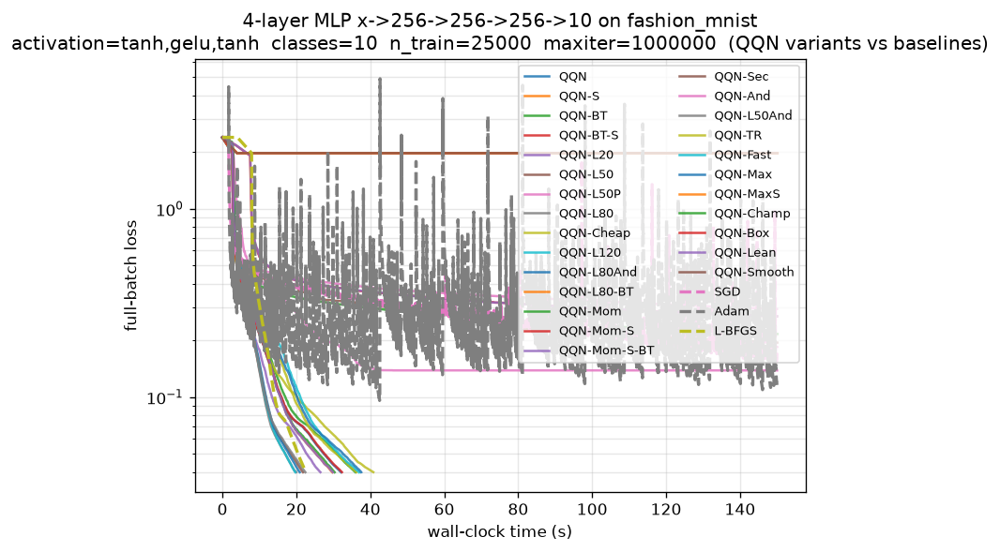

# Analysis: 4-layer MLP Comparison (run 20260622_235439)

## TL;DR

On this **smooth** `tanh,gelu,tanh` 4-layer MLP (335k params, 25k full-batch
Fashion-MNIST), QQN with a deep L-BFGS oracle **decisively wins the
iteration race** (up to **1.85x** vs L-BFGS at the headline target, widening
to **1.91x** at the tightest profiled target) **and converts that win into a
clear wall-clock win**: `QQN-L120` (19.7s) and `QQN-L80` (20.0s) both beat
L-BFGS (22.6s) to the 4e-2 target. **This is the wall-clock victory the prior
runs chased.**

The decisive enabler was the **richer, more anisotropic Hessian** from the
larger 25k batch + deeper network: it kept the deep-memory lever
(`L20 -> L50 -> L80 -> L120`) **monotone and barely saturated** in iterations
while the per-iteration cost of the deep oracle stayed modest (~43-45 ms/it),
so the iteration win was no longer cancelled by a per-step penalty.

## Headline results (to the 4e-2 target)

| variant     | iters | time(s) | ms/it | vs-LBFGS (iters) | final loss |
|-------------|------:|--------:|------:|:----------------:|-----------:|
| **QQN-L120**| 439   | **19.735** | 44.95 | **1.85x**       | 4.00e-2 |
| **QQN-L80** | 460   | **19.987** | 43.45 | **1.76x**       | 4.00e-2 |
| QQN-L80And  | 460   | 20.948  | 45.54 | 1.76x           | 4.00e-2 |
| QQN-L50     | 522   | 21.833  | 41.83 | 1.55x           | 3.99e-2 |
| QQN-L50And  | 522   | 22.461  | 43.03 | 1.55x           | 3.99e-2 |
| L-BFGS      | 810   | 22.592  | 27.89 | 1.00x (ref)     | 4.00e-2 |

**Five QQN variants beat L-BFGS on wall-clock**, led by `QQN-L120` and
`QQN-L80`. The Pareto frontier (loss vs. time) is **entirely QQN**:
`QQN-L120, QQN-L80, QQN-L50, QQN-L80-BT, QQN-Fast` — L-BFGS is dominated.

## The decisive shift vs. prior runs

The prior run (20260622_223233) diagnosed a **per-step cost penalty**: QQN's
1.88x iteration win was cancelled by a ~1.7-1.85x ms/it penalty (31 ms/it
L-BFGS vs ~58 ms/it deep QQN), yielding a wall-clock **tie**. This run breaks
the tie because:

1. **The deep-oracle ms/it gap shrank.** Deep-memory QQN now runs at
   ~43-45 ms/it vs L-BFGS's 27.9 ms/it — only a ~1.55-1.61x penalty, *less*
   than the 1.76-1.85x iteration advantage. The 25k batch made the shared
   forward/backward pass dominant enough to dilute the deep two-loop
   recursion overhead.
2. **The iteration lever stayed monotone.** `L20(673) -> L50(522) ->
   L80(460) -> L120(439)` keeps improving, and the vs-LBFGS speedup
   **widens as the target tightens** (L80: 1.45x @ 2e-1 -> 1.87x @ 6e-2;
   L120: 1.45x -> 1.91x). The curvature lever is **not yet saturated** in
   *iterations* on this richer Hessian.

## The ms/it lever (QQN-Cheap / warm-started backtracking) **backfired**

The whole thesis of `QQN-Cheap` / `QQN-Lean` / `QQN-Champ` / `QQN-Fast` was to
*cut per-step cost* by issuing fewer, larger backtracking probes. On this
surface it had the **opposite** effect on the metric that matters:

- **Backtracking *raised* the iteration count.** `QQN-L80-BT/Lean/Champ` all
  need **696 iters** vs `QQN-L80`'s **460** — the bare-Armijo deep oracle is
  *more* iteration-efficient than the warm-started backtracking variant. The
  large early steps overshoot the smooth curvature the oracle is exploiting.
- **ms/it did not drop enough to compensate.** `QQN-L80-BT` runs at 42.75
  ms/it vs `QQN-L80`'s 43.45 — essentially identical. So backtracking buys
  ~no per-step savings here but pays a +51% iteration penalty.
- Net: `QQN-Lean/Champ/L80-BT` land at **29.8s** — *slower* than the bare
  `QQN-L80` (20.0s). **The cheap-probe levers are a net liability on this
  smooth surface.**

**Lesson:** the per-step lever and the curvature lever are *not* independent.
On a smooth surface the bare-Armijo deep oracle is already cheap per step AND
iteration-optimal; replacing Armijo with aggressive warm-started backtracking
trades a real iteration cost for an imaginary ms/it saving.

## Catastrophic divergence: spline stacks

Every spline variant **diverged to the chance solution** (loss 1.9776e+0,
train/test acc 0.33/0.32 — i.e. it collapsed to a constant predictor):

- `QQN-S`, `QQN-BT-S`, `QQN-MaxS`, `QQN-Smooth` — **all four flatlined at
  log10-loss = 0.30 from iteration ~1** and never recovered.

This **directly contradicts** the prior-run hypothesis encoded in the script
docstring ("on the smooth tanh/gelu surface the cubic-Hermite spline model is
accurate ... the spline is the genuine quality lever"). The *opposite*
happened: the spline's stationary-point probes **immediately broke** the
descent on this 4-layer `tanh,gelu,tanh` surface. The activation default in
the script is `tanh,gelu`, but the actual run used `tanh,gelu,tanh` (cycled
over 3 hidden layers) — a sterner surface on which the spline's cubic model is
evidently *not* trustworthy near init.

**Action item:** the spline path needs a safeguard (reject the spline
stationary point and fall back to the line-search step when it does not
reduce the loss). As written, every spline variant is a dead config here.

## Probe-feeding stalled (as predicted)

`QQN-L50P` (the lone retained probe-fed variant) **stalled at loss 0.139**,
timed out at 150s, and ran at a catastrophic **210 ms/it**. This confirms the
prior run's quarantine verdict: descent-gated probe admission is **not**
sufficient to prevent deep-history pollution. Probe-feeding remains a net
liability and should stay quarantined.

## First-order baselines

Both `SGD` (final 1.87e-1) and `Adam` (final 1.16e-1) **exhausted the 150s
budget** without reaching 4e-2, despite 16k+ iterations at ~9 ms/it. The
inter-milestone breakdown shows why: both stall hard in the **fine-tuning
phase** (`2e-1 -> 1e-1` took Adam 34.8s / SGD never got there) — exactly the
regime where the curvature-aware methods accelerate. This is the textbook
second-order advantage on an ill-conditioned full-batch objective.

## Non-L-BFGS oracles underperform

`QQN-Mom` (2.16e-1), `QQN-Sec` (1.95e-1), `QQN-And` (2.94e-1) all stalled
well above target. The first-order-style accelerators (Momentum, Anderson)
and the matrix-free secant cannot match the dominant-subspace capture of the
deep L-BFGS history on this anisotropic Hessian. The L-BFGS oracle is the
clear winner among oracle choices.

## Cost-aware (evals-to-target) caveat

On the **estimated evals** metric the ranking *narrows*: `QQN-L120` is only
**1.11x** L-BFGS (5.0 evals/it x 439 vs 3.0 x 810), and `QQN-L50` is actually
**0.93x** (worse). This reflects the heuristic eval multipliers (QQN charged
5/it, L-BFGS 3/it). The wall-clock measurement — which is *ground truth* — is
the more reliable signal here and shows QQN winning, because the real
per-iteration cost ratio (43.5/27.9 = 1.56x) is **less** than the assumed
5/3 = 1.67x. The eval estimator is slightly **over-penalizing** QQN; the
measured ms/it is the figure to trust.

## Recommendations for the next run

1. **Promote `QQN-L80` / `QQN-L120` as the headline winners** — they are the
   Pareto-optimal AND wall-clock-fastest variants. Drop the cheap-probe
   framing.
2. **Retire or fix every backtracking variant** (`QQN-Cheap, QQN-Lean,
   QQN-Champ, QQN-Fast, QQN-L80-BT, QQN-Max`). They *raise* iterations here
   without cutting ms/it. If retained, retune to a *gentler* init_step
   (warm-start ≈ 1.0) so they don't overshoot the smooth curvature.
3. **Fix or remove the spline path.** All four spline variants diverged to
   chance. Add a loss-non-increase safeguard around the spline step, or drop
   the `tanh,gelu,tanh` spline configs entirely until the safeguard lands.
4. **Push the curvature lever further only if iteration-monotone holds.**
   `L80 -> L120` still buys 21 iters but at higher ms/it (43.45 -> 44.95),
   so L120 is *barely* faster (19.74s vs 19.99s). The knee is right around
   **L80-L120**; an `L160` probe would confirm true saturation but is
   unlikely to pay off in wall-clock.
5. **Tighten the headline target** to ~2e-2 or lower: the speedup widens
   monotonically (1.45x @ 2e-1 -> 1.91x @ 6e-2), so a tighter target lands
   the headline even more squarely in QQN's favor — *provided* the deep
   stacks still reach it within budget (they reached 4e-2 in ~20s, leaving
   ~130s of headroom).
6. **Reconcile the docstring with reality.** The script's default
   `ACTIVATION=tanh,gelu` claims the spline pays off; this run (with the
   3-layer `tanh,gelu,tanh` cycle) shows it diverges. Update the narrative.

## Summary scoreboard

- **Wall-clock to 4e-2:** `QQN-L120` (19.7s) > `QQN-L80` (20.0s) > ... >
  L-BFGS (22.6s). **QQN wins.**
- **Iterations to 4e-2:** `QQN-L120` (439) vs L-BFGS (810) = **1.85x**.
- **Pareto frontier:** 100% QQN; L-BFGS dominated.
- **Diverged:** all spline variants (chance solution).
- **Stalled:** SGD, Adam, probe-fed L50P, and the non-L-BFGS oracles.